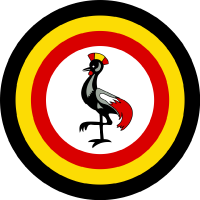

# Uganda Startup Act Project

<h1 align="center" >

[](https://www.startupact.ug/)

</h1>

The Uganda Startup Act project is an initiative by Uganda's tech startup ecosystem and the Government to harness the potential of our digital economy through co-created regulations.

## Table of Contents

- [Project Overview](#project-overview)
- [Goals](#goals)
- [Key Features](#key-features)
- [Technologies Used](#technologies-used)
- [Installation](#installation)
- [Usage](#usage)
- [Contributing](#contributing)
- [License](#license)

## Project Overview

The Uganda Startup Act project aims to create a conducive environment for tech startups in Uganda by developing a comprehensive set of regulations that support their growth and innovation. By fostering collaboration between the startup ecosystem and the government, we intend to drive economic development, attract investments, and promote job creation in the digital sector.

## Goals

- Foster innovation and entrepreneurship in Uganda's tech startup ecosystem.
- Develop a regulatory framework that supports the growth and sustainability of startups.
- Attract local and international investments to fuel the digital economy.
- Streamline bureaucratic processes and reduce barriers for startups.
- Encourage public-private partnerships to drive the digital transformation.

## Key Features

- [ ] **Co-creation**: The regulations will be developed collaboratively by stakeholders from the startup ecosystem and the government, ensuring inclusivity and relevance.
- [ ] **Startup Support Programs**: The project will establish initiatives and programs to provide mentorship, funding, and resources for startups to thrive.
- [ ] **Simplified Licensing**: The aim is to simplify licensing procedures, making it easier for startups to operate and comply with legal requirements.
- [ ] **Investment Incentives**: The project will propose incentives to attract local and foreign investments into the startup ecosystem.
- [ ] **Policy Advocacy**: Advocacy efforts will be undertaken to promote the understanding and adoption of startup-friendly policies at various levels.

## Technologies Used

- Frontend: [Next js](https://nextjs.org/), [JavaScript](https://developer.mozilla.org/en-US/docs/Web/JavaScript)
- Version Control: [Git](https://git-scm.com/)
- Deployment: [Vercel](https://vercel.com/)

## Installation

To get started with the Uganda Startup Act project, follow these steps:

1. Clone the repository: `git clone https://github.com/uganda-startup-act.git`
2. Install the required dependencies: `npm install`

```bash
npm install
# or
yarn install
# or
pnpm i
```

3. Run the development server:

```bash
npm run dev
# or
yarn dev
# or
pnpm dev
```

Open [http://localhost:3000](http://localhost:3000) with your browser to see the result.

## Usage

Please refer to the project's documentation for detailed instructions on how to use the Uganda Startup Act project.

## Contributing

We welcome contributions from individuals and organizations who are passionate about supporting the growth of Uganda's tech startup ecosystem. If you would like to contribute, please follow our [contribution guidelines](CONTRIBUTING.md).

## License

The Uganda Startup Act project is licensed under the [MIT License](LICENSE).
